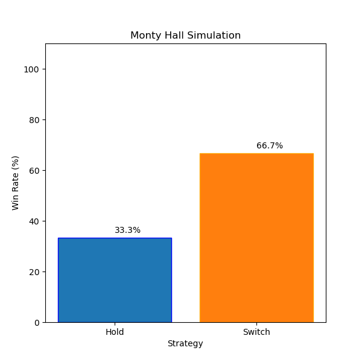

# MountyHall

## Requirements
````
clang
gtest
cmake
ninja
python3
python-matplotlib
```` 

## Instructions
````
Build to ./build using ninja and cmake
    $ make build
    >> ./build

Run tests in ./tests
    $ make test
    >> ./data/tests

Run ./build/MountyHall executable
    $ make run 
    >> ./data

Clean ./data, ./build and ./tests/Testing
    $ make clean 

Commands can be chained e.g.
    $ make clean_build_test_run

Flags
    -o, --output -> output file (CSV)
    -n, --num -> number of runs (per each of the 2 strategies and divided by 2 threads each)
    -p, --plot -> plot the data in a qt6 graph plot
```` 

## Results
As expected from statistical analysis of the problem, the 'hold' strategy yields a win 1/3 of the times and the 'switch' strategy does so 2/3 of the times. 
cqd___


